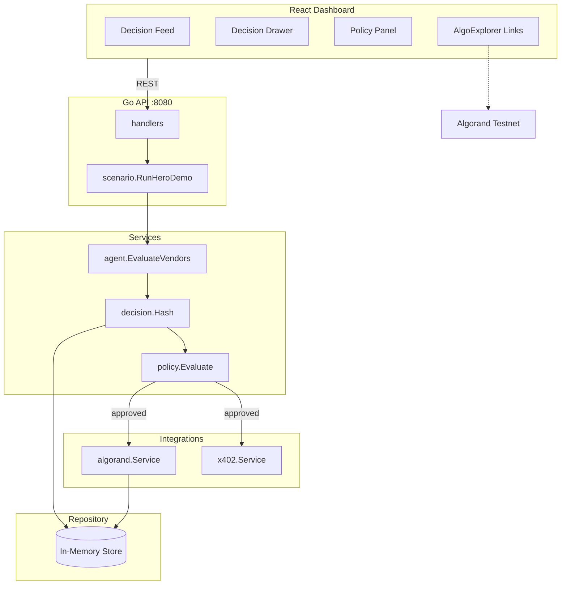

# RationAlgo

**Algorand-native policy & transparency layer for agentic commerce.**

Before an AI agent pays via x402, RationAlgo records *why* it chose to spend — vendor, alternatives, expected value, confidence, and policy checks. A hash of that decision is committed to Algorand Testnet. After payment, outcomes are compared to predictions so humans can audit agent spending.

Built for the [Algorand x402 Agentic Commerce Hackathon](https://luma.com/agentic-commerce-hack) (Infrastructure + EURQ tracks).

---

## Repo layout

| Path | Purpose |
|------|---------|
| `backend/` | Go API — config, services, models, repository |
| `backend/cmd/rationalgo/` | CLI entrypoint (spikes now, HTTP API in Phase 1) |
| `backend/internal/config/` | Environment configuration |
| `backend/internal/models/` | Domain types |
| `backend/internal/services/` | Business logic (`algorand`, `x402`, `decision`) |
| `backend/internal/repository/` | In-memory persistence |
| `backend/internal/util/` | Shared helpers (explorer URLs) |
| `frontend/` | React audit dashboard (pre-built) |

---

## Phase 0 — Quick start

All backend commands run from `backend/`:

```bash
cd backend
```

### 1. Configure wallet

```bash
cp .env.example .env
```

Edit `backend/.env`:

```env
# Paste your Pera Testnet address here
RATIONALGO_WALLET_ADDRESS=PASTE_YOUR_PERA_WALLET_ADDRESS_HERE

# Leave empty for public AlgoNode testnet
RATIONALGO_ALGOD_TOKEN=

# 25-word passphrase from Pera → Settings → Security (same account)
RATIONALGO_MNEMONIC=word1 word2 ... word25
```

Fund the account on [Algorand Testnet dispenser](https://bank.testnet.algorand.network/) if balance is low.

### 2. Build

```bash
go build -o bin/rationalgo ./cmd/rationalgo
```

### 3. Check config

```bash
go run ./cmd/rationalgo
# or
./bin/rationalgo
```

### 4. Run integration spikes

```bash
go run ./cmd/rationalgo spike all
go run ./cmd/rationalgo spike algorand   # testnet hash commitment
go run ./cmd/rationalgo spike x402       # GoPlausible 402 probe
```

**Phase 0 exit criteria**

- [ ] `spike algorand` prints a real `tx_id` and [Pera Explorer](https://testnet.explorer.perawallet.app) link
- [ ] `spike x402` returns HTTP `402 Payment Required`

---

## Backend structure

```
backend/
├── cmd/rationalgo/          # thin CLI — delegates to services
├── internal/
│   ├── config/              # env loading + validation
│   ├── models/              # AlgorandSpikeResult, X402ProbeResult, …
│   ├── repository/          # in-memory store
│   ├── services/
│   │   ├── algorand/        # client (chain) + service (orchestration)
│   │   ├── x402/            # HTTP 402 probe / payment (Phase 2)
│   │   └── decision/        # Decision Record hashing
│   └── util/                # explorer link helpers
├── .env                     # local secrets (gitignored)
└── .env.example
```

---

## Architecture (target)



---

## Frontend (dashboard)

```bash
cd frontend
bun install
bun run dev
```

The UI currently runs a scripted mock demo. Phase 1 wires it to the Go API.

---

## Environment variables

| Variable | Required | Description |
|----------|----------|-------------|
| `RATIONALGO_WALLET_ADDRESS` | Yes | Pera Testnet address |
| `RATIONALGO_ALGOD_TOKEN` | No | Algod API token (empty for public nodes) |
| `RATIONALGO_MNEMONIC` | Yes | 25-word passphrase (backend signing) |
| `RATIONALGO_ALGOD_URL` | No | Default: AlgoNode testnet |
| `RATIONALGO_X402_PROBE_URL` | No | Default: GoPlausible testnet demo |
| `RATIONALGO_HTTP_ADDR` | No | Default: `:8080` (Phase 1+) |

Never commit `backend/.env`.

---

## Hackathon demo (hero flow)

1. Agent needs weather data → evaluates vendors
2. Decision Record generated with reasoning
3. Policy engine approves
4. Reasoning hash committed on Algorand
5. x402 payment in EURQ
6. Vendor price spikes 10×
7. Policy flags anomaly → purchase rejected
8. Dashboard shows audit trail + trust scores

---

## License

Hackathon submission — MIT (TBD).
